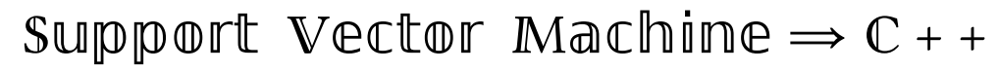
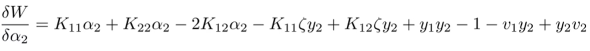
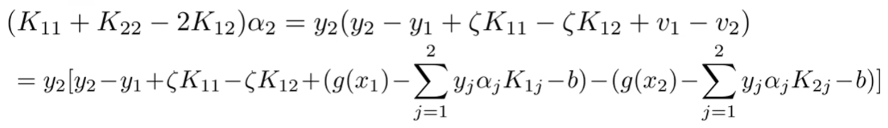
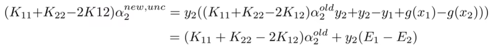

# SVMCPP



> SVM algorithm based on Gaussian kernel and dual computation


## Dual SVM


$$
min_{\alpha}\frac{1}{2}\sum_{i}\sum_{j}\alpha_{i}\alpha_{j}y_{i}y_{j}x_{i}^{T}x_{j}-\sum_{i}\alpha_{i}\newline
$$

$$
s.t.\ \ \ \ \sum_{i}\alpha_{i}y_{i}=0\ \alpha_{i}\in[0,C]\newline
$$

$$
w=\sum_{i}\alpha_{i}y_{i}x_{i}\newline
$$

$$
b=y_{i}-\sum_{j}\alpha_{j}y_{j}x_{j}^{T}x_{i}\ for\ examples\ i\ where\ \alpha_{i}\in(0,C)
$$

$$
y_i \in \{-1,+1\} i \in [1,N]
$$

## SMO(Sequential minimal optimization)

- Turn big problems into subproblems
- Platt,1998

- Select two elements $(\alpha_a, \alpha_b)$ in vector $\alpha$ for iterative calculation

$$
min_{\alpha_{a},\alpha_{b}} \frac{1}{2}K_{aa}\alpha_{a}^{2}+\frac{1}{2}K_{bb}\alpha_{b}^{2}\newline
+\frac{1}{2}\alpha_{a}y_{a}\sum_{j\ne a}y_{j}\alpha_{j}K_{aj}+\frac{1}{2}\alpha_{b}y_{b}\sum_{j\ne b}y_{j}\alpha_{j}K_{bj}-\alpha_{a}-\alpha_{b}\newline
$$

$$
s.t.\ \ \ \ y_{a}\alpha_{a}+y_{b}\alpha_{b}=-\sum_{i\ne a, b}\alpha_{i}y_{i}\ \ \ \ \alpha_{a}, \alpha_{b}\in[0,C]
$$

- The optimization of a binary function is transformed into a monadic optimization function

$$
y_{a}\alpha_{a}+y_{b}\alpha_{b}=-\sum_{i\ne a, b}\alpha_{i}y_{i}
$$

$$
y \in \{-1,+1\}
$$

$$
y_{a}^2\alpha_{a}+y_{a}y_{b}\alpha_{b}=y_{a} \times -\sum_{i\ne a, b}\alpha_{i}y_{i}
$$

$$
\zeta := -\sum_{i\ne a, b}\alpha_{i}y_{i}
$$

$$
\alpha_{a}=y_{a}\zeta-y_{a}y_{b}\alpha_{b}
$$

- A quadratic function can find the maximum value at once!

- Iterative process

$$
\alpha_{a}^{old},\alpha_{b}^{old} \rightarrow \alpha_{a}^{new},\alpha_{b}^{new}
$$

- value range


- Binary variable solving procedure

    - Solve for unconstrained extremum points, recorded as $\alpha_{b}^{new, unc}$

    - Solve for constrained extremum points, recorded as $\alpha_{b}^{new}$

- Calculate the difference between the predicted value and the actual label

$$
g(x)=\sum_{i=1}^{N}\alpha_{i}y_{i}K(x_{i}, x)+b
$$

$$
E_{i}=g(x_{i})-y_{i}=\sum_{j=1}^{N}\alpha_{j}y_{j}K(x_{j}, x_{i})+b-y_{i}, i=a,b
$$

- Introduce new variable quantization reduction, calculate the derivative to calculate the extreme value

$$
v_i := \sum_{j\ne a, b}^{N} \alpha_{j}y_{j}K(x_{i}, x_{j})=g(x_{i})-\sum_{j}\alpha_{j}y_{j}K(x_{i},x_{j})-b, j=a,b, i = a, b
$$

- Objective function


- derivative



$$
make\ \alpha_{2}=0
$$



$$
\zeta = \alpha_{1}^{old}y_{1}+\alpha_{2}^{old}y_{2}
$$



$$
\eta = K_{11}+K_{22}-2K_{12}
$$

$$
\alpha_{2}^{new,unc}=\alpha_{2}^{old}+\frac{y_{2}(E_1-E_2)}{\eta}
$$

## Gaussian kernel

$$
K(x_i,x_j)=e^{-\frac{||x_i-x_j||^2}{2\sigma^2}}
$$

## How to run it?

```shell
mkdir build
cd build
cmake ..
make
SVMCPP
```